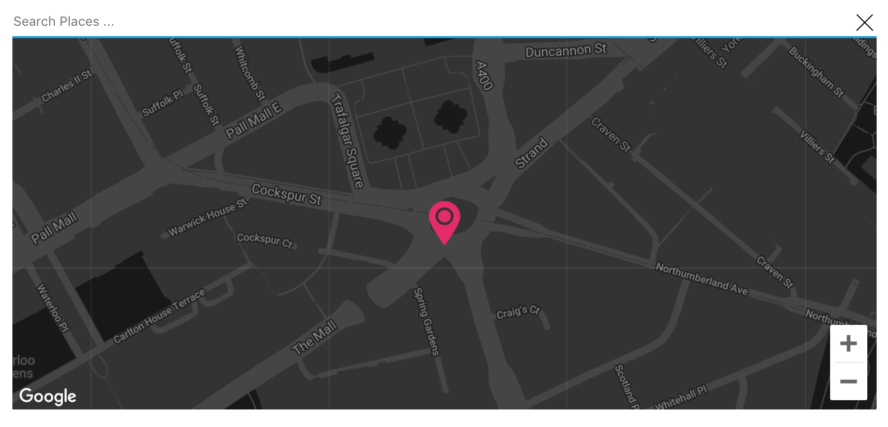
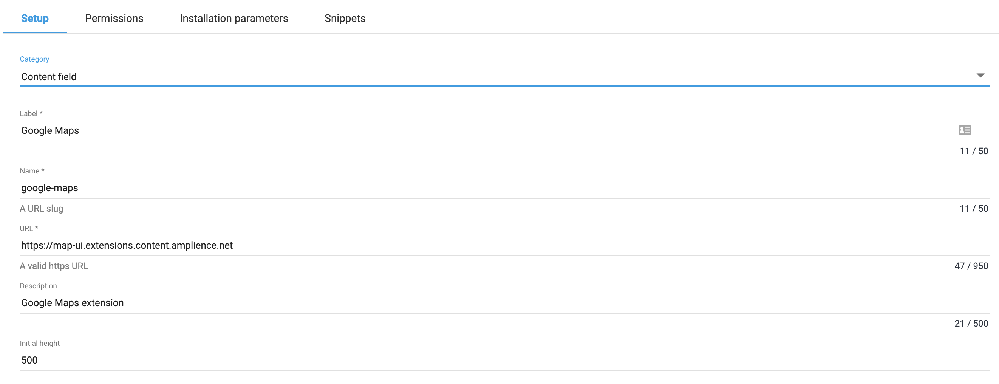
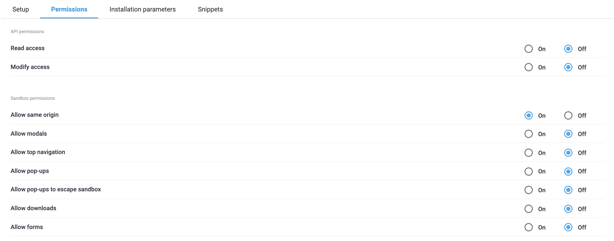
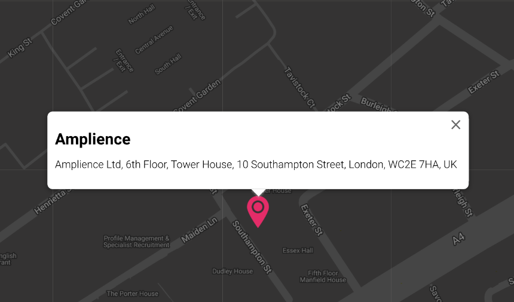

[](https://amplience.com/dynamic-content)

# dc-extension-map-ui

The map ui extension allows content authors easily search and select location on the Google maps and add it to content.
Location latitude and longitude are added to the content as object.



## How to install

### Register Extension

This extension needs to be [registered](https://amplience.com/docs/development/registeringextensions.html) against a Hub with in the Dynamic Content application (Developer -> Extensions), for it to load within that Hub.



* Category: Content Field
* Label: Google Map
* Name: google-map _(needs to be unique with the Hub)_
* URL: [https://map-ui.extensions.content.amplience.net](https://map-ui.extensions.content.amplience.net)
* Description: Google maps extension  _(can be left blank, if you wish)_
* Initial height: 500

Note:
You can use our deployed version of this extension (builds from the "production" branch) -

[https://map-ui.extensions.content.amplience.net](https://map-ui.extensions.content.amplience.net)

_As this is an open source project you're welcome to host your own "fork" of this project. You can use any standard static hosting service (Netlify, Amplify, Vercel, etc.) if you wish._

### Permissions



Sandbox permissions:
- Allow same origin

### Installation Parameters

| Paramerter  |  Default  | Notes   | Required |
|---|---|---|---|
| apiKey | empty | Google maps API key. | true
| theme | Dark | Google maps styling theme, put Light to set standard light theme. | false
| searchPlaceholderText | Search Places ... | Placeholder text to show in the search box. | false

### Assign the extension to schema

```json

{
  "location": {
    "title": "Location",
    "description": "Place location latitude and longitude",
    "type": "object",
    "properties": {
      "lat": {
        "title": "Latitude",
        "type": "number"
      },
      "lng": {
        "title": "Longitude",
        "type": "number"
      }
    },
    "ui:extension": {
      "url": "https://map-ui.extensions.content.amplience.net",
      "params": {
        "apiKey": "{{apiKey}}",
        "theme": "Light",
        "searchPlaceholderText": "Search for places ..."
      }
    }
  }
}
```

### Extended Example Snippet

```json

{
  "location": {
    "title": "Location",
    "description": "Place location latitude and longitude",
    "type": "object",
    "properties": {
      "lat": {
        "title": "Latitude",
        "type": "number"
      },
      "lng": {
        "title": "Longitude",
        "type": "number"
      }
    },
    "ui:extension": {
      "url": "https://map-ui.extensions.content.amplience.net",
      "params": {
        "apiKey": "{{apiKey}}"
      }
    }
  },
  "locationName": {
    "title": "Location name",
    "description": "Short name of location to show, ex \"Amplience office\"",
    "type": "string",
    "maxLength": 56
  },
  "locationAddress": {
    "title": "Location address",
    "description": "Full address of location",
    "type": "string",
    "maxLength": 100
  },
  "theme": {
    "title": "Theme",
    "description": "",
    "enum": [
      "Dark",
      "Light"
    ]
  },
  "mapZoom": {
    "title": "Zoom",
    "description": "Initial zoom on map",
    "type": "string"
  },
  "gestureHandling": {
    "title": "Gesture zoom",
    "description": "Handles gestures on the map",
    "enum": [
      "Auto",
      "Greedy",
      "Cooperative"
    ]
  },
  "zoomControl": {
    "title": "Zoom control",
    "description": "Displays \"+\" and \"-\" buttons for changing the zoom level of the map",
    "type": "boolean"
  },
  "mapTypeControl": {
    "title": "Map type control",
    "description": "Is available in a dropdown or horizontal button bar style, allowing the user to choose a map type",
    "type": "boolean"
  },
  "streetViewControl": {
    "title": "Street view control",
    "description": "Contains a Pegman icon which can be dragged onto the map to enable Street View",
    "type": "boolean"
  },
  "fullscreenControl": {
    "title": "Full screen control",
    "description": "Offers the option to open the map in fullscreen mode",
    "type": "boolean"
  }
}
```

You can use extended snippet to have ability customize controls, theme, marker info window text in content item.  
By using standard snippet all controls are disabled, no info window on click on marker.

## Google maps API key

Follow [instructions](https://developers.google.com/maps/documentation/javascript/get-api-key) to get your own Google maps API key.  
Required APIs are - Geocoding API, Maps JavaScript API, Places API.

## Visualization

Visualization can be set using next link: 

`https://map-ui.extensions.content.amplience.net?vse={{vse.domain}}&content={{content.sys.id}}&apiKey={{apiKey}}`



Don't forget to replace {{apiKey}} with your Google maps API key.  
You can always create your own visualization, designed according your website.

## Available Scripts

In the project directory, you can run:

### `npm start`

Runs the app in the development mode.  
Open [https://localhost:3000](https://localhost:3000) to view it in the browser.

The page will reload if you make edits.  
You will also see any lint errors in the console.

### `npm test`

Launches the test runner.  

### `npm run build`

Builds the app for production to the `build` folder.  
It correctly bundles React in production mode and optimizes the build for the best performance.

The build is minified and the filenames include the hashes.  
By default, Create React App produces a build assuming your app is hosted at the server root.  
To override this, specify the homepage in your `package.json`, for example:
 
 `"homepage": "."`

Your app is ready to be deployed!
